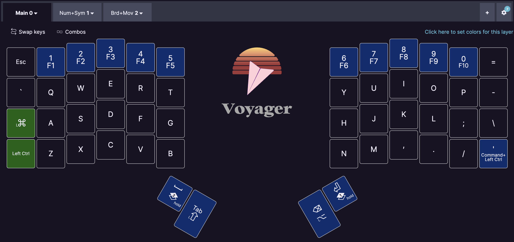

# Custom Keyboards

I try to keep my dotfiles for several tools open source as it comes handy if somebody asks for them.
In practice they use highly custom keybindings which often do not make sense for everybody.
This repository fits in this gap and introduces a reason why: custom keyboard layouts.

My keybindings and keyboard layouts are meant to be used in conjunction but still try be useful with my default laptop keyboard, because once in a while you don't have an external keyboard nearby.
In general I use macOS and Linux, tiling window managers (Hyprland on Linux, AeroSpace on macOS), Helix (a terminal editor) and Kitty as terminal emulator.
As far as possible I try to avoid collisions between keybindings and assign different modifiers to different purposes:

- `ctrl` is free for all applications
- `ctrl+super` is used for Kitty and the tiling window manager

> [!note]
> I try to keep my current layout in sync for all keyboards once I use them. Therefore they might diverge for a few weeks.

## General thoughts on my layout

I try to keep my layout close to US qwerty for all symbols as I recently made the switch from German qwertz. Most used modifiers are promoted to the thumb clusters.

Although I occasionally use the number row for actual numbers opposed to their special characters, I very much prefer the numpad on the left split. Some keys up there force me to leave the homerow. Also note that I do not use function keys with some exceptions every few months.

Layer toggles are currently always positioned at the thumbs.

## Overview

| **Keyboard**            | Firmware   | Keys |
| ----------------------- | ---------- | ---- |
| [Kyria rev3](#Kyria)    | ZMK        | 50   |
| [ZSA Voyager](#Voyager) | QMK (Oryx) | 52   |
| [Lily58 Pro](#Lily58)   | QMK        | 58   |

## Kyria

| **Board**      | Kyria rev3                                             |
| -------------- | ------------------------------------------------------ |
| **Firmware**   | ZMK                                                    |
| **Controller** | nice!nano                                              |
| **Display**    | nice!view                                              |
| **Keys**       | 50                                                     |
| **Switches**   | Kailh Choc Ambients Silent Twilight (linear, 35gf)     |
| **Keycaps**    | MBK Legend 40s grey                                    |
| **Keymap**     | [config/kyria_rev3.keymap](./config/kyria_rev3.keymap) |

The Kyria is the latest addition to my collection and my first wireless ZMK build. The goal was to get a silent and portable keyboard.
It has an aggressive pinky-stagger, a large thumb cluster, but no number row.

> [!warning]
> This layout currently changes a lot and has no overview yet.

## ZSA Voyager

| **Board**    | ZSA Voyager                                                            |
| ------------ | ---------------------------------------------------------------------- |
| **Firmware** | QMK with Oryx from ZSA                                                 |
| **Keys**     | 52                                                                     |
| **Switches** | Kailh Choc Sunset (tactile, 40gf)                                      |
| **Keycaps**  | International Voyager Keycaps                                          |
| **Keymap**   | on [ZSA Oryx](https://configure.zsa.io/voyager/layouts/YV79Q/latest/0) |

> **Note:** as this is outside of this git repository it might be less stable and changed more frequently. Some changes might be revoked, too.

The base layer is pretty standard with prominent locations for space, tab and shift on the left side. The right thumb cluster includes enter, backspace and alt.

The Number and Symbols layer spreads the keypad on the left side in two rows. The right side includes all sorts of brackets and German umlauts.

The Board setting and Movement layer starts with LED settings on the left side and places cursor movements on top of `hjkl` to reflect vim motions. Below are `Home`, `Page Down` etc and on top are mouse movements. All in the same ordern.

## Lily58 Pro

| **Board**      | Lily58 Pro                                               |
| -------------- | -------------------------------------------------------- |
| **Firmware**   | QMK                                                      |
| **Controller** | PPro Micro ATmega32u4                                    |
| **Keys**       | 58                                                       |
| **Switches**   | Kailh Choc Brown (tactile, 50gf)                         |
| **Keycaps**    | Choc PBT/PC Keycaps white                                |
| **Keymap**     | [lily58/lily58-keymap.json](./config/lily58-keymap.json) |

The first split keyboard that I soldered myself. Initially I thought the sheer amount of 58 keys would help me migrate from a full keyboard and make me feel comfortable sooner, but in the end I didn't need that many keys, especially as all the extra keys compared to my Voyager and Kyria are hard to reach for me. I just can't find any comfortable way to reach them, leaving 3 total keys untouched for every split - effectively using just 52 keys where one important one is uncomfortable to reach.

> [!warning]
> This layout might be outdated as I prefer to use the other keyboards. Due to ergonomics and preference I only use the Voyager subset of all keys.

The base layer is pretty standard with prominent locations for space, tab and shift on the left side. The right thumb cluster includes enter, backspace and alt.

The Number and Symbols layer spreads the keypad on the left side in two rows. The right side includes all sorts of brackets and German umlauts.

The Board setting and Movement layer starts with LED settings on the left side and places cursor movements on top of `hjkl` to reflect vim motions. Below are `Home`, `Page Down` etc and on top are mouse movements. All in the same ordern.

